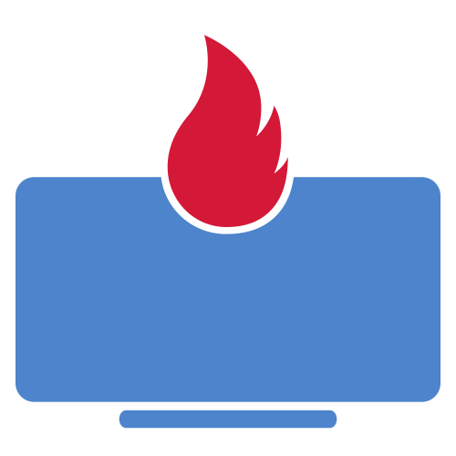

<!--
*** Thanks for checking out the Best-README-Template. If you have a suggestion
*** that would make this better, please fork the repo and create a pull request
*** or simply open an issue with the tag "enhancement".
*** Don't forget to give the project a star!
*** Thanks again! Now go create something AMAZING! :D
-->

<!-- PROJECT SHIELDS -->
<!--
*** I'm using markdown "reference style" links for readability.
*** Reference links are enclosed in brackets [ ] instead of parentheses ( ).
*** See the bottom of this document for the declaration of the reference variables
*** for contributors-url, forks-url, etc. This is an optional, concise syntax you may use.
*** https://www.markdownguide.org/basic-syntax/#reference-style-links
-->
[![Contributors][contributors-shield]][contributors-url]
[![Forks][forks-shield]][forks-url]
[![Stargazers][stars-shield]][stars-url]
[![Issues][issues-shield]][issues-url]
[![Apache 2.0 License][license-shield]][license-url]
[![LinkedIn][linkedin-shield]][linkedin-url]

<!-- PROJECT LOGO -->
 

  

<h3 align="center">Remotify</h3>

  

    Gather with fun
     
    <!-- <a href="https://github.com/flodev/remotify"><strong>Explore the docs »</strong></a> -->
     
     
    <a href="https://meet.remotify.place">View Demo</a>
    ·
    <a href="https://github.com/flodev/remotify/issues">Report Bug</a>
    ·
    <a href="https://github.com/flodev/remotify/issues">Request Feature</a>
  

<!-- TABLE OF CONTENTS -->

  
Table of Contents

  <ol>
    <li>
      <a href="#about-the-project">About The Project</a>
      <ul>
        <li><a href="#built-with">Built With</a></li>
      </ul>
    </li>
    <li>
      <a href="#getting-started">Getting Started</a>
      <ul>
        <li><a href="#prerequisites">Prerequisites</a></li>
        <li><a href="#installation">Installation</a></li>
      </ul>
    </li>
    <li><a href="#usage">Usage</a></li>
    <li><a href="#roadmap">Roadmap</a></li>
    <li><a href="#contributing">Contributing</a></li>
    <li><a href="#license">License</a></li>
    <li><a href="#contact">Contact</a></li>
    <li><a href="#acknowledgments">Acknowledgments</a></li>
  </ol>

<!-- ABOUT THE PROJECT -->
## About The Project

[![Product Name Screen Shot][product-screenshot]](https://meet.screen_recording_webrtc.gif)

Remotify is here to create an enjoyable work atmosphere and culture in a virtual place. Remotify is all about openness, self determination and fun.  
You can meet and work, express your feelings, change the room to your needs and even adapt the code to your needs and host it for youselves.

(<a href="#top">back to top</a>)

### Built With

* [React.js](https://reactjs.org/)
* [Phaser.js](https://phaser.io/)
* [Hasura GraphQL](https://hasura.io/)
* [Next.js](https://nextjs.org/)
* [Ant Design](https://ant.design)

(<a href="#top">back to top</a>)

<!-- USAGE EXAMPLES -->
## Usage

Use this space to show useful examples of how a project can be used. Additional screenshots, code examples and demos work well in this space. You may also link to more resources.

_For more examples, please refer to the [Documentation](https://example.com)_

(<a href="#top">back to top</a>)

<!-- ROADMAP -->
## Roadmap

- [] Feature 1
- [] Feature 2
- [] Feature 3
    - [] Nested Feature

See the [open issues](https://github.com/flodev/remotify/issues) for a full list of proposed features (and known issues).

(<a href="#top">back to top</a>)

<!-- CONTRIBUTING -->
## Contributing
### Prerequisites

* install docker
* install kubctl (https://kubernetes.io/docs/tasks/tools/)
* install minikube (https://minikube.sigs.k8s.io/docs/start/)
* install helm chart (https://helm.sh/docs/intro/install/)

### Installation

* install pgadmin
  * helm repo add bitnami https://charts.bitnami.com/bitnami
  * helm install postgres bitnami/postgresql
* minikube -p remotify start
* get db pw
  * echo $(kubectl get secret --namespace default postgres-postgresql -o jsonpath="{.data.postgresql-password}" | base64 --decode)
* kubectl port-forward --namespace default svc/postgres-postgresql 5432:5432
* minikube -p remotify tunnel

(<a href="#top">back to top</a>)

<!-- LICENSE -->
## License

Distributed under the Apache 2.0 License. See `LICENSE` for more information.

(<a href="#top">back to top</a>)

<!-- CONTACT -->
## Contact

<!-- Your Name - [@twitter_handle](https://twitter.com/twitter_handle) - email@email_client.com -->

Project Link: [https://github.com/flodev/remotify](https://github.com/flodev/remotify)

(<a href="#top">back to top</a>)

<!-- ACKNOWLEDGMENTS -->
## Acknowledgments

* 
* 
* 

(<a href="#top">back to top</a>)

<!-- MARKDOWN LINKS & IMAGES -->
<!-- https://www.markdownguide.org/basic-syntax/#reference-style-links -->
[contributors-shield]: https://img.shields.io/github/contributors/flodev/remotify.svg?style=for-the-badge
[contributors-url]: https://github.com/flodev/remotify/graphs/contributors
[forks-shield]: https://img.shields.io/github/forks/flodev/remotify.svg?style=for-the-badge
[forks-url]: https://github.com/flodev/remotify/network/members
[stars-shield]: https://img.shields.io/github/stars/flodev/remotify.svg?style=for-the-badge
[stars-url]: https://github.com/flodev/remotify/stargazers
[issues-shield]: https://img.shields.io/github/issues/flodev/remotify.svg?style=for-the-badge
[issues-url]: https://github.com/flodev/remotify/issues
[license-shield]: https://img.shields.io/github/license/flodev/remotify.svg?style=for-the-badge
[license-url]: https://github.com/flodev/remotify/blob/main/LICENSE
[linkedin-shield]: https://img.shields.io/badge/-LinkedIn-black.svg?style=for-the-badge&logo=linkedin&colorB=555
[linkedin-url]: https://www.linkedin.com/in/florian-klenk-93347187/
[product-screenshot]: screen_recording_webrtc.gif