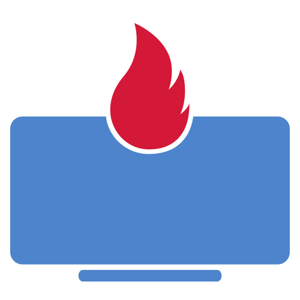
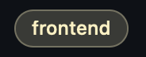
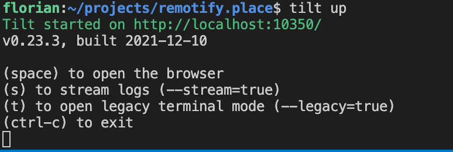

<!--
*** Thanks for checking out the Best-README-Template. If you have a suggestion
*** that would make this better, please fork the repo and create a pull request
*** or simply open an issue with the tag "enhancement".
*** Don't forget to give the project a star!
*** Thanks again! Now go create something AMAZING! :D
-->

<!-- PROJECT SHIELDS -->
<!--
*** I'm using markdown "reference style" links for readability.
*** Reference links are enclosed in brackets [ ] instead of parentheses ( ).
*** See the bottom of this document for the declaration of the reference variables
*** for contributors-url, forks-url, etc. This is an optional, concise syntax you may use.
*** https://www.markdownguide.org/basic-syntax/#reference-style-links
-->
[![Contributors][contributors-shield]][contributors-url]
[![Forks][forks-shield]][forks-url]
[![Stargazers][stars-shield]][stars-url]
[![Issues][issues-shield]][issues-url]
[![Apache 2.0 License][license-shield]][license-url]
[![LinkedIn][linkedin-shield]][linkedin-url]

<!-- PROJECT LOGO -->
 

  

<h3 align="center">Remotify</h3>

  

    Gather with fun
     
    <a href="http://docs.remotify.place"><strong>Explore the docs »</strong></a>
     
     
    <a href="https://meet.remotify.place">View Demo</a>
    ·
    <a href="https://github.com/flodev/remotify/issues">Report Bug</a>
    ·
    <a href="https://github.com/flodev/remotify/issues">Request Feature</a>
  

<!-- TABLE OF CONTENTS -->

  
Table of Contents

  <ol>
    <li>
      <a href="#about-the-project">About The Project ❓</a>
      <ul>
        <li><a href="#built-with">Built With 🏗️</a></li>
      </ul>
    </li>
    <li>
      <a href="#usage">Usage 🎮</a>
      <ul>
        <li><a href="#make-yourself-at-home">Make yourself at home 🏠</a></li>
        <li><a href="#invite-your-friends">Invite your friends 👩‍👩‍👦‍👦</a></li>
      </ul>
    </li>
    <!-- <li><a href="#roadmap">Roadmap</a></li> -->
    <li>
      <a href="#contributing">Contributing 👩‍💻</a>
      <ul>
        <li><a href="#frontend-only">Frontend only 📱</a></li>
        <li><a href="#run-whole-remotify-on-your-system">Run whole remotify on your system 👑</a></li>
      </ul>
    </li>
    <li><a href="#license">License</a></li>
    <li><a href="#contact">Contact</a></li>
    <li><a href="#acknowledgments">Acknowledgments</a></li>
  </ol>

<!-- ABOUT THE PROJECT -->
## About The Project

❓

Remotify is here to create an enjoyable work atmosphere and culture in a virtual place. Remotify is all about openness, self determination and fun.  
You can meet and work, express your feelings, change the room to your needs and even adapt the code to your needs and host it for youselves.  

[![Product Name Screen Shot][product-screenshot]](https://meet.remotify.place)

(<a href="#top">back to top</a>)

### Built With

🏗️

* [React.js](https://reactjs.org/)
* [Phaser.js](https://phaser.io/)
* [Hasura GraphQL](https://hasura.io/)
* [Next.js](https://nextjs.org/)
* [Ant Design](https://ant.design)

(<a href="#top">back to top</a>)

<!-- USAGE EXAMPLES -->
## Usage

🎮

Go to https://meet.remotify.place  
Once the app is loaded you can do different things

### Make yourself at home  

🏠

On the left top side there is a 🍔 menu.  
Click on it and you reveal the only option currently available.   
Click on Edit mode, close the menu and you will see edit toolbar.  
There you can modify the place to your needs.

### Invite your friends  

👩‍👩‍👦‍👦

There is an invite button on the top of the screen.  
When you click on it an url is copied to your clipboard automatically.  
This link can be shared with the people you want to invite and have fun with.

(<a href="#top">back to top</a>)

<!-- ROADMAP -->
<!-- ## Roadmap 🛣️

- [] Feature 1
- [] Feature 2
- [] Feature 3
    - [] Nested Feature

See the [open issues](https://github.com/flodev/remotify/issues) for a full list of proposed features (and known issues).

(<a href="#top">back to top</a>)
 -->

<!-- CONTRIBUTING -->
## Contributing  

👩‍💻

First of all I really appreciate every contribution of you. Thanks in advance 🤝 🤗  
I'm actively looking for contributers.   
Especially for design biased frontend people who would like to reinvent the look and feel of remotify.  
Somehow everything I touch ends up looking nerdy 🤷‍♂️  
  
There are two ways depending on whether you want to work in the backend or frontend.  
### Frontend only 

📱

* filter or keep an I out for issues with the label 
* checkout the project using git clone https://github.com/flodev/remotify.git  
* checkout a feature branch  
* run `npm install` or `yarn install`
* run `npm run storybook` or `yarn storybook` 

### Run whole remotify on your system

👑

This step isn't particularely difficult either. You just have to install a few more things.  
I've tried my best to do a local setup for you as easy as possible.

* install docker (https://www.docker.com/get-started)
* install minikube (https://minikube.sigs.k8s.io/docs/start/)
* install kubctl (https://kubernetes.io/docs/tasks/tools/)
* install helm chart (https://helm.sh/docs/intro/install/)
* install tilt (https://docs.tilt.dev)

create minikube profile  
*  execute `minikube start -p tilt-remotify`

now run the system
* checkout the project using git clone https://github.com/flodev/remotify.git 
* checkout a feature branch  
* navigate to the root folder of remotify (where Tiltfile is located)
* then run `tilt up`  

Now tilt watches over your file change activities and will reload to kubernetes pod as soon as you update a file.

NOTE: It will probably take a few beats to get the system up and running.  
You can open the browser to see the progress.  
The frontend currently takes a bit too long to get up and running. Once it's up you can reach it using the browser `http://localhost:3001`.
It should look this way in your terminal:  

After consideration I suggest that you run the frontend from your local system and use all the other systems from tilt.  
The frontend build just takes to long to work with that productivly.
I've set the trigger mode in tilt to manual so you need to click on  to update the frontend.

<!-- LICENSE -->
## License

Distributed under the Apache 2.0 License. See `LICENSE` for more information.

(<a href="#top">back to top</a>)

<!-- CONTACT -->
## Contact

<!-- Your Name - [@twitter_handle](https://twitter.com/twitter_handle) - email@email_client.com -->

Project Link: [https://github.com/flodev/remotify](https://github.com/flodev/remotify)

(<a href="#top">back to top</a>)

<!-- ACKNOWLEDGMENTS -->
## Acknowledgments

(<a href="#top">back to top</a>)

<!-- MARKDOWN LINKS & IMAGES -->
<!-- https://www.markdownguide.org/basic-syntax/#reference-style-links -->
[contributors-shield]: https://img.shields.io/github/contributors/flodev/remotify.svg?style=for-the-badge
[contributors-url]: https://github.com/flodev/remotify/graphs/contributors
[forks-shield]: https://img.shields.io/github/forks/flodev/remotify.svg?style=for-the-badge
[forks-url]: https://github.com/flodev/remotify/network/members
[stars-shield]: https://img.shields.io/github/stars/flodev/remotify.svg?style=for-the-badge
[stars-url]: https://github.com/flodev/remotify/stargazers
[issues-shield]: https://img.shields.io/github/issues/flodev/remotify.svg?style=for-the-badge
[issues-url]: https://github.com/flodev/remotify/issues
[license-shield]: https://img.shields.io/github/license/flodev/remotify.svg?style=for-the-badge
[license-url]: https://github.com/flodev/remotify/blob/main/LICENSE
[linkedin-shield]: https://img.shields.io/badge/-LinkedIn-black.svg?style=for-the-badge&logo=linkedin&colorB=555
[linkedin-url]: https://www.linkedin.com/in/florian-klenk-93347187/
[product-screenshot]: readme-assets/screen_recording_webrtc.gif